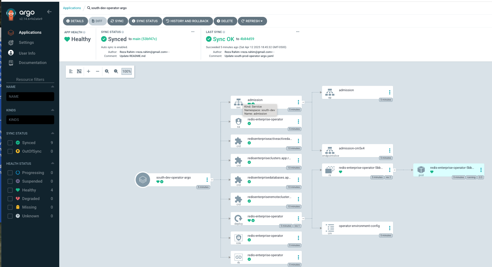
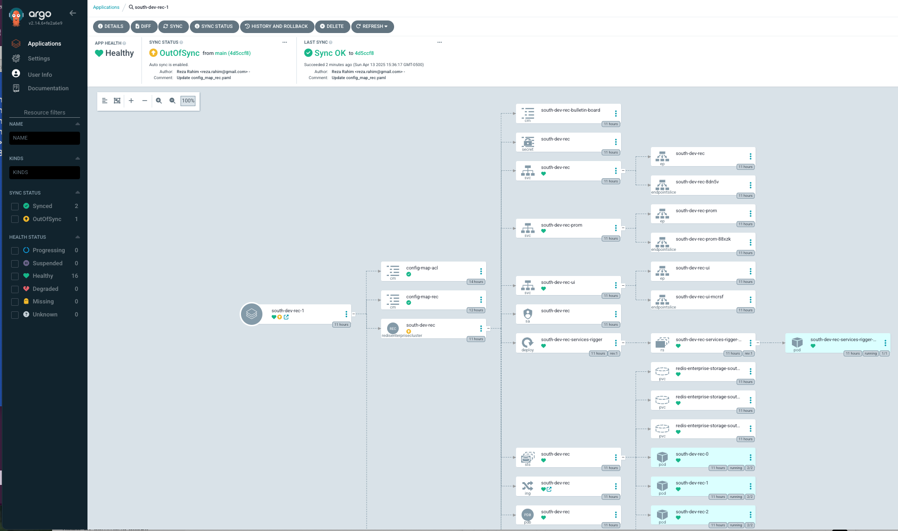

# Redis Enterprise (RE) GitOps-Style Automated Deployment with ArgoCD on K8/Openshift

This guide outlines a GitOps-style, fully automated deployment of **two Redis Enterprise (RE) clusters** — one in the **north** and one in the **south** — using **ArgoCD** on **Kubernetes or OpenShift** environments. The primary objective is to shift all manual operations to the *initial setup phase*, so that once the automation begins, there are no intermediate manual steps required.

---

##  Initial Setup (Manual Prerequisites)

Before enabling GitOps automation, you need to perform the following **manual setup steps**. These are **one-time operations** that prepare your environment for a fully automated RE deployment.


### 1. Create a Shared S3-Compatible Bucket

A **shared object store** (e.g., AWS S3, MinIO, Ceph) is required to:

- Share the cluster topology configuration.
- Exchange sealed secrets between clusters.

You’ll need to create a bucket (e.g., `re-shared-config`) accessible to both RE clusters.


### 2. Define Cluster Topology

Inside the shared bucket, create a file named `cluster_config.json`. This file outlines the participating RE clusters, their roles, and where to store their state/configuration within the bucket. <br>
The values in the JSON file may vary across environments like dev, test, and prod. To handle this, we can create environment-specific directories and place the corresponding cluster_config.json file in each one.

- [S3_bucket]/dev
- [S3_bucket]/test
- [S3_bucket]/prod


```json
[
  {
    "clusername": "south",
    "s3_dir": "south",
    "apiFqdnUrl": "api.south.ps-redis.com",
    "dbFqdnSuffix": "-cluster.south.ps-redis.com",
    "apiPort": 443
  },
  {
    "clusername": "north",
    "s3_dir": "north",
    "apiFqdnUrl": "api.north.ps-redis.com",
    "dbFqdnSuffix": "-cluster.north.ps-redis.com",
    "apiPort": 443
  }
]
```

### 3. Create AWS Credentials Secret
On each Kubernetes or OpenShift cluster (in the target namespace where RE will be deployed), create a Kubernetes secret with your object store credentials:

```
kubectl create secret generic aws-credentials -n <namespace> \
  --from-literal=AWS_ACCESS_KEY_ID=<your-access-key-id> \
  --from-literal=AWS_SECRET_ACCESS_KEY=<your-secret-access-key>

```

### 4. Generate and Share PKI Key Pair for Sealed Secrets
To securely share sealed secrets across clusters, we use a shared RSA key pair (private/public). All clusters must use the same key pair for encryption and decryption of sensitive data (e.g., passwords, tokens).<br>

a. Generate the RSA Key Pair:
```
openssl genpkey -algorithm RSA -out private_key.pem
openssl rsa -pubout -in private_key.pem -out public_key.pem
```
b. Create Kubernetes Secret in Each Cluster:<br>
Distribute the key pair to all participating clusters by creating a secret in the target namespace:

```
kubectl create secret generic rsa-keys -n <namespace> \
  --from-file=private_key.pem \
  --from-file=public_key.pem
```

### 5. Create username and password for health check upser


```
kubectl create secret generic health-check-user -n  $NSP \
  --from-literal=username=health-check-user@example.com \
  --from-literal=password=<password>
```

---

## Setup ArgoCD on K8 
```
kubectl create namespace argocd
kubectl apply -n argocd -f https://raw.githubusercontent.com/argoproj/argo-cd/stable/manifests/install.yaml

# https://localhost:8080/ for ArgoCD webUI 
# use admin/initial-password to login
kubectl port-forward svc/argocd-server -n argocd 8080:443

# How to get the initial-password
argocd admin initial-password -n argocd
kubectl get secret -n argocd argocd-initial-admin-secret -o jsonpath="{.data.password}" | base64 -d
```

### Argo CD Resource Hooks
Argo CD resource hooks offer flexibility by allowing users to execute custom scripts at various stages of the application’s lifecycle. This can be particularly useful in scenarios that require going beyond the default behavior provided by Kubernetes. [More on Argo CD Resource Hooks](https://codefresh.io/learn/argo-cd/argo-cd-hooks-the-basics-and-a-quick-tutorial/)<br>

Let's build a custom Docker container to handle various pre- and post-processing tasks using ArgoCD hooks.

The [Dockerfile](docker/Dockerfile)
```
docker build -t rezarahim/alpine-tools:1.1 .
docker push  rezarahim/alpine-tools:1.1
```
---

## Redis Enterprise for Kubernetes Documentaion

**We assume you are familiar with the manual process of deploying Redis Enterprise (RE) using the operator in a Kubernetes environment.** <br>
[Redis Enterprise for Kubernetes](https://redis.io/docs/latest/operate/kubernetes/)

[Redis Enterprise for Kubernetes Github location for Example and CRD ](https://github.com/RedisLabs/redis-enterprise-k8s-docs)

---
## Setup the South Cluster


### Let's look into [ArgoCD Application](https://argo-cd.readthedocs.io/en/stable/core_concepts/) [south-dev-operator-argo.yaml](https://github.com/reza-rahim/redis-enterprise-argocd/blob/main/south/south-dev-operator-argo.yaml) for dev env.

```
apiVersion: argoproj.io/v1alpha1
kind: Application
```
- This defines the resource type — an Application from ArgoCD.

- This is how you tell ArgoCD what to deploy and where.


```
metadata:
  name: south-dev-operator-argo
  namespace: argocd
```
- name: This is the name of your ArgoCD Application.

- namespace: This is the namespace where ArgoCD itself is installed, not where your app is deployed. ArgoCD watches its own namespace (argocd).

#### Source — Where to get the manifests
```
  source:
    repoURL: https://github.com/reza-rahim/redis-enterprise-argocd/
    targetRevision: main
    path: south/operator-chart
    helm:
      valueFiles:
      - dev-values.yaml
```
This tells ArgoCD where to pull your deployment config from:

- repoURL: GitHub repo that contains your app’s Helm chart or Kubernetes YAML.

- targetRevision: Git branch to track — here it’s main.

- path: Folder in the repo that contains the Helm chart.

- helm.valueFiles: You’re using Helm, and passing dev-values.yaml — likely contains environment-specific settings (like image versions, replicas, resource limits, etc.).

#### Destination — Where to deploy
```
  destination:
    server: https://kubernetes.default.svc
    namespace: dev
```
- server: Tells ArgoCD to deploy to the Kubernetes cluster it's running in.

- namespace: The app will be deployed into the prod namespace in the cluster.

#### Sync Policy — How it stays in sync
```
  syncPolicy: 
    automated:
      prune: true
      selfHeal: true
    syncOptions:
      - CreateNamespace=true
```
This controls how ArgoCD keeps the app in sync with Git:

- automated: Enables automatic syncing (no need to click “Sync” manually).

- prune: true: Deletes resources from the cluster if they're no longer in Git.

- selfHeal: true: Automatically fixes any drift if something changes in the cluster.

syncOptions:

- CreateNamespace=true: If the prod namespace doesn’t exist, ArgoCD will create it for you.

**Let's look into ArgoCD Application [south-prod-operator-argo.yaml](https://github.com/reza-rahim/redis-enterprise-argocd/blob/main/south/south-prod-operator-argo.yaml) for prod env.**<br>

Main Differencein the helm.valueFiles section:
```
helm:
  valueFiles:
  - dev-values.yaml
  - prod-values.yaml
```
Helm allows multiple values files to be layered. When two or more files are used, So prod-values.yaml will override any overlapping settings from dev-values.yaml.

---
### Deploy the Redis Operator for South cluster.
```
  kubectl apply -n argocd -f south-dev-operator-argo.yaml
  kubectl get -n south-dev  po
```
<br>
ArgoCD UI:

<br>

---
### Deploy the Redis cluser for South cluster.
```
kubectl apply -n argocd -f south-dev-rec-argo.yaml
  kubectl get -n south-dev  po
```
  
<br>
ArgoCD UI:

<br>

---

### Deploy the Redis Operator for North cluster.
```
  kubectl apply -n argocd -f north-dev-operator-argo.yaml
  kubectl get -n south-dev  po
```

---
### Deploy the Redis cluser for South cluster.
```
kubectl apply -n argocd -f north-dev-rec-argo.yaml
kubectl get -n south-dev  po
```
---
1. Kubernetes Job (redis-job)
- Triggered post-install using Helm hooks.

- Waits for the target Redis Enterprise Cluster API to become available via repeated curl checks.

--Sources two config scripts:

--config-map-acl.sh (ACL/user setup)

--config-map-rec.sh (cluster sync and secret handling)
